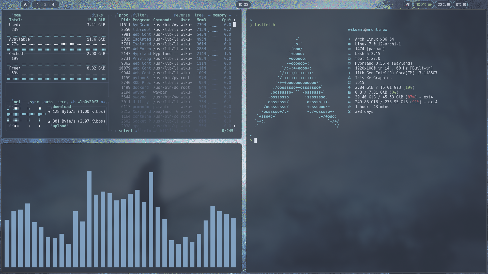

# nord-hyprland-theme
# Linux Rice

My personal Linux rice.

## Screenshots

| Desktop                      |
| ---------------------------- |
|  |
|  |

## System

* **Distro:** Arch Linux
* **Compositor:** Hyprland
* **Terminal:** Foot
* **Shell:** ble.sh
* **Browser:** LibreWolf
* **Theme:** Nord
* **Font:** Inter
* **Launcher:** Rofi


## Installation

Clone the repository:

```bash
git clone https://github.com/Wikuami/nord-hyprland-theme.git
```

Copy the desired configuration files into `~/.config`.

## License

MIT
